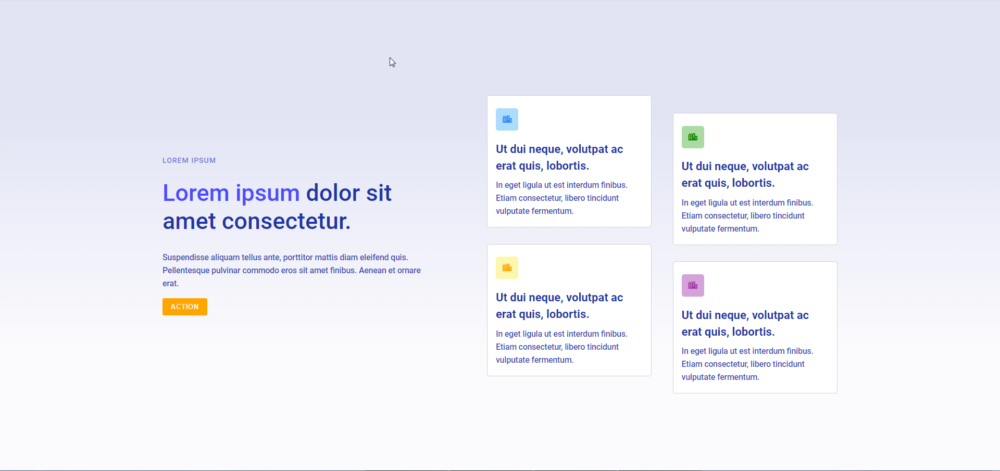

# Zadanie rekrutacyjne 
W tym zadaniu rekrutacyjnym próbowałam skupić się na jak najleszym odtworzeniu projektu w oparciu o sam plik png.
Stronę zaczęłam tworzyć z podejściem Mobile First. Używałam flexboxa, klas i zmiennych.
Zastosowałam gradientowe tło zamiast obrazu z figurami. Projekt jest napisany w czystym CSS, bez preprocesora typu SASS/LESS.

## Wersja live
[https://solwika.github.io/Zadanie-rekrutacyjne/]

## Zrzut ekranu
Wersja desktop:
